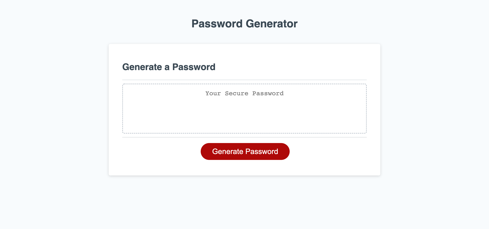
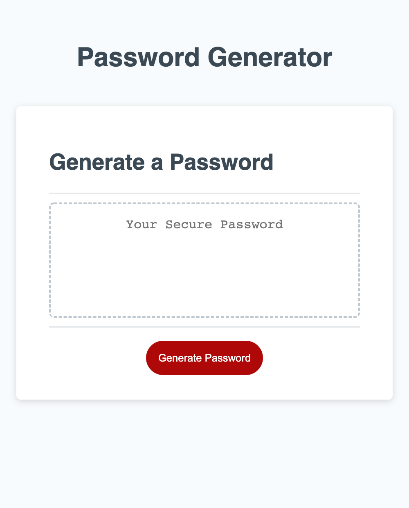

# password-generator

## Description

This is a password generator functioning for universal needs. An advanced password including special characters, upper and lower cases will dramatically increase the accounts security.

## Run the website

You can open the website by clicking here. 
https://dark40.github.io/password-generator/

## Data Validation
The website will generate a password between 8 and 128 characters. If letters are entered or the length doesn't fall into the criteria, an error alter message will prompt. 

At least one of four criteria must be chosen for generating password. Otherwise, an alter will prompt. 

## Screenshots

